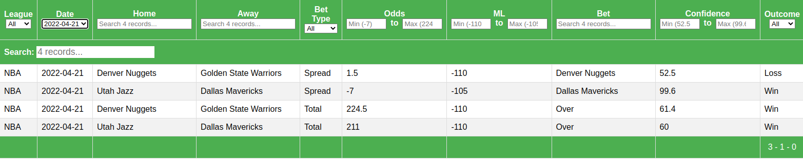
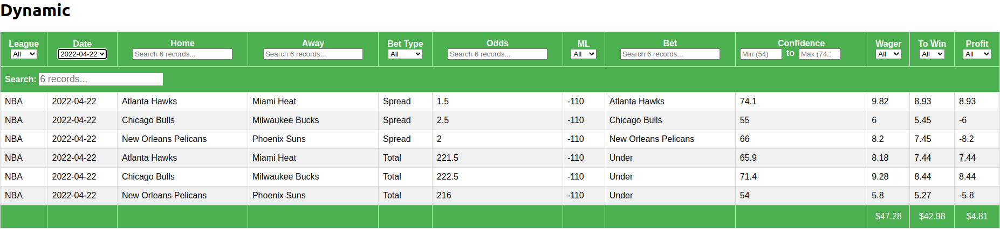

Sports-Betting
==============================
This project uses machine learning to predict the outcome of common bets (Spread, Moneyline, Total) in four sports leagues (NFL, NBA, College Football, College Basketball).

# See the latest predictions [here](https://personal-website-app-gfrfw.mongodbstitch.com/sports-betting/).

  

## Contents

[1. Data Collection](#Data-Collection)\
[2. Data Cleaning](#Data-Cleaning)\
[3. Modeling](#Modeling)\
[4. Agents](#Agents)\
[5. Frontend](#Frontend)

<!-- TODO link to the specific scraping README, do the same for other sections -->
## [1. Data Collection](Data_Collection/README.md)
This project focuses on four leagues: NFL, NBA, NCAAF, and NCAAB. The following sections describe how data was collected from each source.

### ESPN
<!-- teams, rosters, schedule, game, player stats, players -->
There are 5 ESPN web scrapers to collect [rosters](/src/data/espn_rosters.py), [schedules](/src/data/espn_schedule.py), [game stats](/src/data/espn_game.py), [player stats](/src/data/espn_player_stats.py), and [player information](/src/data/espn_players.py).
All data is saved to [the ESPN data folder](/data/external/espn/).

- Roster data includes all players and their ESPN ID for each team. This is used to keep track of which team players are on at a given time.
- Schedule data includes the date and ESPN ID for every game.
- After the schedule data is scraped, the espn game scraper scrapes the actual stats from each completed game.
- The ESPN player stats scraper also scrapes each individual player's stats from each game.
- Finally, the espn player scraper simply scrapes attributes about each player like height and weight from their bio page on ESPN.

### Sportsbook Reviews Online
Historical betting odds were previously scraped from a website called "Sportsbook Reviews Online" that is no longer operational. Those odds are kept in the [/data/raw/](/data/raw/) folder for each league.

New odds are collected from other sources, so all odds since 2007 are used in this project.

### Elite Sportsbook
The [Elite Sportsbook scraper](/Data_Collection/esb.py) scrapes odds for upcoming games from [elitesportsbook.com](https://www.eliteportsbook.com), an online sportsbook based in Iowa.

### Covers.com
Injuries can make a huge impact on sports betting.
Therefore, I wrote the [Covers injury scraper](/Data_Collection/covers.py) to scrape injury data from [covers.com](https://www.covers.com/).
Each player's injury status is given to the models as input data, and when a player is out, their data is omitted entirely.

## [2. Data Cleaning](/Data_Cleaning/)

### ESPN
The ESPN web scrapers store the raw data from the website, but that isn't always in a clean format for machine learning.
The [clean ESPN script](/Data_Cleaning/clean_espn.py) reformats the data into a format that is easy to work with.
For example, it takes stats with dashes like 10-12 free throws, and converts it to 10 free throws made and 12 free throws attempted.
This cleaned data is saved to [/Data/ESPN/](/Data/ESPN/) (outside the league folders).

### Sportsbook Reviews Online
Similarly, the Sportsbook Reviews Online data is not in a clean format for machine learning.
This data is downloaded as .xlsx files, which represent each game's bets in two rows.
The [clean SBO script](/Data_Cleaning/clean_sbo.py) reformats each game into one row, with cleaned values.

### Matching Teams and Players
Since this project uses multiple data sources, sometimes the sources use different names for teams and players (e.g. "LA Chargers" and "Los Angeles Chargers").
I use the names from ESPN as the "correct" names, and edit names from other sources to match ESPN for consistency.
The [match teams script](/Data_Cleaning/match_teams.py) matches the team names from non-ESPN sources to the names from ESPN.
The alternate names are saved to the [team JSON files](/Data/Teams/) in the "Other Names" field.

### Merging Datasets
Once all the data is collected and cleand, the [merge datasets script](/Data_Cleaning/merge_datasets.py) merges the cleaned data from all sources.
These datasets are saved in [/Data/](/Data/).

### Labeling Predictions
After predictions are made by the models and agents, the [label predictions script](/Data_Cleaning/label_predictions.py) and [label agents script](/Data_Cleaning/label_agents.py) label the predictions with the true result.

## [3. Modeling](/Modeling/)

insert stuff here

## [4. Agents](/Agents/)

Agents use rules-based methods to make bets with the models' predictions.
They're created to give a more realistic measure of how useful the models are.

<!-- ### Baseline -->

### Flat
The [flat betting agent](/Agents/flat.py) simply wagers $10 on every predicted bet.
Whether the models are strongly in favor of the outcome or on the fence, this agent will bet the same amount every time.

### Dynamic
The [dynamic betting agent](/Agents/dynamic.py) wagers more money when the models are more confident.
This agent can place anywhere from \$5 to \$15 on each bet.

## [5. Frontend](/Frontend/)

All predictions and agent bets made in this project can be seen [here](https://personal-website-app-gfrfw.mongodbstitch.com/sports-betting/).
This site is a simple [React](https://reactjs.org/) app that uses [MongoDB](https://www.mongodb.com/) and to store predictions and [React-Table](https://react-table.tanstack.com/) to display the data.

  

It also shows how well the agents and alternate bets perform on different tabs.

For example, here's the dynamic agent's page:

  

